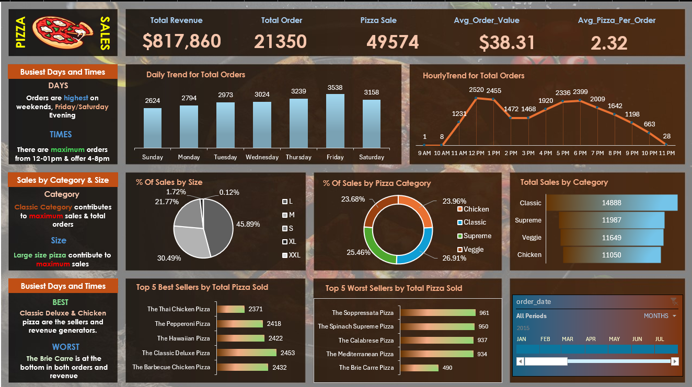

# Pizza Sales Data Analysis (SQL + Excel)

## Project Overview
This project analyzes sales data for a pizza restaurant to identify trends, top-performing products, and customer behavior. The goal was to build a dynamic Excel dashboard for visualization while verifying the accuracy of the data using SQL queries.

## Tools Used
* **Data Analysis:** Microsoft Excel (Pivot Tables, Charts, Dashboarding)
* **Data Verification:** SQL (SSMS/MySQL) to validate KPI calculations.
* **Database:** [Insert Database Name, e.g., MS SQL Server]

## Key Performance Indicators (KPIs)
I calculated the following metrics using SQL to ensure the accuracy of the Excel dashboard:
* **Total Revenue:** $817,860
* **Average Order Value:** $38.31
* **Total Pizzas Sold:** 49,574
* **Total Orders:** 21,350
* **Avg Pizzas Per Order:** 2.32

## Key Insights & Trends
### 1. Daily & Hourly Trends
* **Busiest Days:** Friday is the busiest day of the week with **3,538 orders**, followed by Thursday (3,239) and Saturday (3,158).
* **Peak Hours:** Order volume peaks significantly around **12:00 PM - 1:00 PM** (Lunch rush) and **5:00 PM - 6:00 PM** (Dinner rush).

### 2. Sales Performance
* **Best Selling Category:** The **Classic** category contributes the most to sales (26.91%), followed closely by Supreme (25.46%).
* **Preferred Sizes:** Large (L) pizzas are the most popular, accounting for **45.89%** of total sales. XL and XXL sizes account for less than 2% combined.

### 3. Best & Worst Sellers
* **Top 5 Best Sellers:** The *Classic Deluxe Pizza* is the #1 best seller (2,453 sold), followed by the *Barbecue Chicken Pizza* (2,432).
* **Bottom 5 Worst Sellers:** The *Brie Carre Pizza* is the lowest-performing pizza with only 490 sold.

## SQL Verification
The SQL queries used to verify the data can be found in the `SQL_Queries.sql` file. These queries validate the Total Revenue, Average Order Value, and Sales by Category calculations seen in the Excel dashboard.

## Dashboard Snapshot

